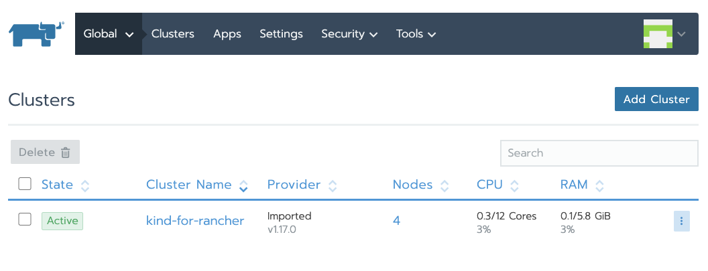

# Usage

This repo is used to create rancher and add a kubernetes cluster with kind (kubernetes in docker) in Rancher.

* Run Rancher UI
* create Kubernetes cluster (by kind)
* change rancher admin’s password
* update server url in rancher
* create an imported cluster in rancher
* add new kubernetes cluster’s nodes in the new created cluster in Rancher. You should see 4 nodes are added automatically



### Prerequisite

1) Make sure you have installed Kind (kubernetes in docker) locally.

The installation instruction is here: https://kind.sigs.k8s.io/docs/user/quick-start/

2) Adjust docker engine memory

Default docker engine is set to use 2GB runtime memory, adjust it to 8GB if you can.

### Get help

```
$ ./rkind.sh
Usage: ./rkind.sh [FLAGS] [ACTIONS]
  FLAGS:
    -h | --help | --usage   displays usage
    -q | --quiet            enabled quiet mode, no output except errors
    --debug                 enables debug mode, ignores quiet mode
  ACTIONS:
    create                create new Rancher & Kind cluster
    destroy               destroy Rancher & Kind cluster created by this script
  Examples:
    $ ./rkind.sh create
    $ ./rkind.sh destroy

Update kind (kuberentes in docker) configuration in local kind.yaml (https://kind.sigs.k8s.io/)
```

### Create the stack

```
$ ./rkind.sh create
INFO: Launching Rancher container
522c72ef91bc725296afc95e809bab00c30be1739788b26cd39d22df4024b16a
INFO: Rancher UI will be available at https://192.168.1.100:33976
INFO: It might take few up to 60 seconds for Rancher UI to become available..
INFO: While it's coming up, going to start KIND cluster
No kind clusters found.
INFO: Creating Kind cluster with 3 nodes (default)...
Creating cluster "kind-for-rancher" ...
 ✓ Ensuring node image (kindest/node:v1.17.0) 🖼
 ✓ Preparing nodes 📦 📦 📦 📦
 ✓ Writing configuration 📜
 ✓ Starting control-plane 🕹️
 ✓ Installing CNI 🔌
 ✓ Installing StorageClass 💾
 ✓ Joining worker nodes 🚜
Set kubectl context to "kind-kind-for-rancher"
You can now use your cluster with:

kubectl cluster-info --context kind-kind-for-rancher

Thanks for using kind! 😊
### Next steps ###
- Setup admin credentials in Rancher UI
- Set "Rancher Server URL" to "https://192.168.1.100:33976" (should already be selected)
  you may change it at any time in "Settings"
- wait for 2 minute
- Import KIND cluster to Rancher (via https://192.168.1.100:33976/g/clusters/add?provider=import)
  (select "Import Existing cluster" when adding a cluster)
  > To work around "Unable to connect to the server: x509: certificate signed by unknown authority"
  > use "curl --insecure" which is provided by Rancher UI to get the manigest, piping it's output to, for example:

    curl --insecure -sfL https://192.168.1.100:33486/v3/import/6qbm7q9lk7gmqsgt4l2hrrchlxbfh6fjskzb8tx84mjrl9jvhb8xcm.yaml | kubectl apply -f -

- set context to kind cluster

kubectl cluster-info --context kind-kind-for-rancher

### Destroy
To shut everything down, use "./rkind.sh destroy", or manually with
docker rm -f rancher-for-kind; kind delete cluster kind-for-rancher
```
### destroy the stack

```
$ ./rkind.sh --destroy
INFO: Destroying Rancher container..
rancher-for-kind
INFO: Destroying Kind cluster..
Deleting cluster "kind-for-rancher" ...
```

### custom kind configuration

If you'd like to change the kind configuration, please update file [kind.yaml](kind.yaml). For details, go through https://kind.sigs.k8s.io/
